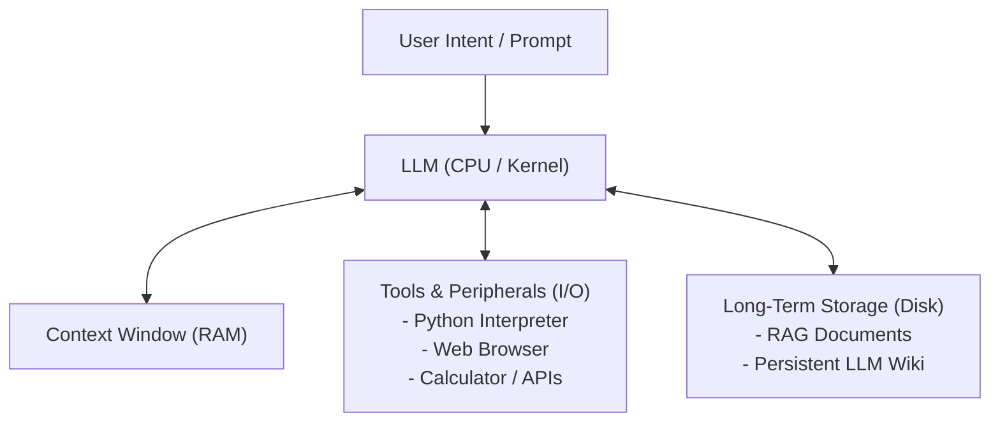

# LLM OS (The LLM Operating System)

> **Summary**: A conceptual systems architecture proposed by Andrej Karpathy that models the Large Language Model not as a mere chatbot, but as the central processing unit (CPU) and kernel process of an emerging operating system.

---

## 1. Definition & Core Thesis
- **Origin**: [[Andrej_Karpathy]]'s November 2023 lecture, *"Intro to Large Language Models"*.
- **The Core Analogy**: Karpathy maps the components of a modern computer operating system to an LLM-centric stack:
  - **LLM**: The **CPU**. It does not perform all computations natively; instead, it coordinates, reasons over natural language intent, and orchestrates tasks.
  - **Context Window**: The **RAM**. Working memory holding active state, intermediate thoughts, and immediate reference documents.
  - **Tools & Peripherals**: **I/O Devices**. Web browsers, calculators, Python code interpreters, terminal execution, and external APIs.
  - **External Storage (RAG / Wiki)**: The **Disk Storage**. File systems and persistent knowledge bases for long-term memory retrieval.

## 2. Deterministic vs. Intent-Based Computing
- **Traditional OS**: Executes deterministic machine instructions (x86/ARM) designed by human engineers.
- **LLM OS**: Operates via **reasoning over intent**. Given an ambiguous user objective, it dynamically breaks down subgoals, invokes specialized tools (e.g., executing Python to generate a plot or query an API), inspects results, and iterates toward completion.

## 3. System Components & Architecture

## 4. Key Challenges & Security Vectors
1. **Context Window Limitations (RAM Management)**: Managing what to keep in working memory versus what to page out to external disk/Wiki.
2. **Prompt Injection (Jailbreaking)**: The LLM equivalent of buffer overflow attacks and remote code execution vulnerabilities.
3. **Hallucination & Verification**: Ensuring the CPU's reasoning outputs are grounded in verifiable external computation rather than lossy probabilistic memory.

## 5. Connections & Context
- [[LLM_Wiki]] - The persistent, compiled disk storage layer designed specifically for LLM OS agents.
- [[LLM_Training_Pipeline]] - The manufacturing process that creates the CPU's kernel weights (Pretraining, SFT, RLHF).
- [[Software_2_0]] - The broader paradigm shift that enables neural architectures to run system logic.
- [[Andrej_Karpathy]] - Author and evangelist of the LLM OS mental model.

---

## Sources & References
- [[../sources/20231122_intro_to_llms_and_llm_os|20231122_intro_to_llms_and_llm_os.md (YouTube 1hr Talk)]]
