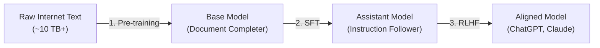

# LLM Training Pipeline

> **Summary**: The three-stage engineering process—Pre-training, Supervised Fine-Tuning (SFT), and Reinforcement Learning from Human Feedback (RLHF)—required to transform raw web text into an aligned, instruction-following assistant.

---

## 1. The Three Stages of LLM Development

### Stage 1: Pre-training (Knowledge Compression)
- **Goal**: Compress a large chunk of the internet (~10TB+ text) into neural network parameters.
- **Compute**: Enormous compute clusters (thousands of GPUs, millions of dollars, weeks of wall-clock time).
- **Outcome**: A **Base Model**. It acts as a lossy "zip file" of human knowledge. It predicts the next word in internet documents, dreaming up web pages, but cannot reliably answer questions directly.

### Stage 2: Supervised Fine-Tuning (SFT / Alignment)
- **Goal**: Teach the model to converse in the style of a helpful assistant rather than continuing arbitrary documents.
- **Data**: ~100,000 high-quality, human-curated Question & Answer dialogues based on detailed labeling guidelines (prioritizing quality over raw quantity).
- **Compute**: Cheap (~1 day on modest clusters).
- **Outcome**: An **Assistant Model** that answers user questions while preserving the broad world knowledge acquired in Stage 1.

### Stage 3: Reinforcement Learning from Human Feedback (RLHF)
- **Goal**: Optimize the model's outputs for truthfulness, helpfulness, and safety.
- **Mechanism**: Labelers compare multiple candidate responses to rank which is superior (pairwise comparisons are significantly easier for humans than generating answers from scratch). A reward model is trained on rankings, and the LLM is fine-tuned using reinforcement learning (PPO / DPO).

---

## 2. Karpathy's "Two Files" Mental Model
- Stripped of marketing mystique, an LLM fundamentally consists of just two files:
  1. **The Parameters File**: The weights of the neural network (e.g., 140 GB for Llama-2-70B in float16).
  2. **The Run File**: A compact program (e.g., ~500 lines of pure C) executing the matrix multiplications and activations.
- With these two files, the model runs completely standalone and air-gapped on a personal laptop.

---

## 3. Connections & Context
- [[LLM_OS]] - The resulting assistant model acts as the CPU kernel of the agentic operating system.
- [[Character_Level_Language_Model]] - The algorithmic predecessor of next-token autoregressive generation.
- [[Andrej_Karpathy]] - Pioneer in demystifying this pipeline through educational initiatives (`nanoGPT`, `llm.c`).

---

## Sources & References
- [[../sources/20231122_intro_to_llms_and_llm_os|20231122_intro_to_llms_and_llm_os.md (YouTube 1hr Talk)]]
