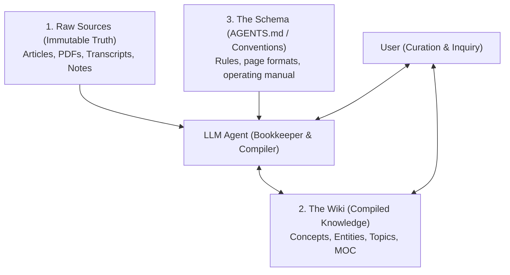

# LLM Wiki

> **Summary**: A pattern for building persistent personal knowledge bases using LLM agents. Instead of rediscovering knowledge on every query via RAG, the LLM incrementally compiles raw sources into an evolving, interlinked Markdown wiki.

---

## 1. The Core Idea: Compilation vs. Retrieval
- **Author**: [[Andrej_Karpathy]] (April 2026, GitHub Gist `llm-wiki.md`).
- **The Problem with Traditional RAG**:
  - Most LLM setups retrieve raw document chunks at query time.
  - The model rediscovers knowledge from scratch on every question; nothing accumulates. Complex queries requiring synthesis across multiple sources force the model to piece together fragments anew each time.
- **The LLM Wiki Alternative**:
  - **"Stop Retrieving, Start Compiling."**
  - An LLM agent sits between the user and the raw sources, incrementally maintaining a structured, interlinked collection of Markdown files.
  - When a new source is added, the LLM extracts key insights, cross-references existing pages, flags contradictions, and updates topic overviews.
  - The knowledge is **compiled once and kept current**, creating a persistent, compounding artifact.

---

## 2. The Three-Layer Architecture

1. **Raw Sources (`sources/` or `raw/`)**:
   - Curated primary documents. Strictly immutable—the source of ground truth that the LLM reads but never alters.
2. **The Wiki (`wiki/`)**:
   - LLM-generated Markdown files: concepts, entities, topics, and synthesis. The LLM creates, updates, and cross-references them via `[[WikiLink]]` syntax.
3. **The Schema (`AGENTS.md` / `CLAUDE.md`)**:
   - The operational constitution defining folder conventions, ingestion steps, query protocols, and health check heuristics.

---

## 3. The Division of Labor (Solving the Bookkeeping Problem)
- **Why Traditional Personal Wikis Fail**:
  - Humans abandon knowledge bases because the manual maintenance burden (cross-referencing, tagging, updating summaries, resolving contradictions) grows faster than the value of the wiki.
- **The Human's Job**: High-level curation, deep reading, asking thoughtful questions, and directing explorations.
- **The LLM's Job**: The tedious grunt work—summarizing, cross-referencing, updating indices, filing, and continuous bookkeeping.
- **Workflow Setup**: Karpathy pairs the LLM agent on one side of the screen with Obsidian on the other:
  > *"Obsidian is the IDE; the LLM is the programmer; the wiki is the codebase."*

---

## 4. Connections & Context
- [[Stop_Retrieving_Start_Compiling]] - The underlying philosophical transition from RAG to persistent compilation.
- [[LLM_OS]] - The long-term storage and retrieval layer for autonomous agent systems.
- [[Software_2_0]] - Parallels compiling source data into an interconnected knowledge binary.
- [[Andrej_Karpathy]] - Author and originator of the pattern.

---

## Sources & References
- [[../sources/20260918_karpathy_llm_wiki|20260918_karpathy_llm_wiki.md (GitHub Gist)]]
